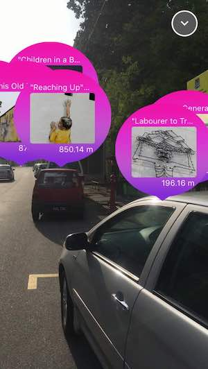
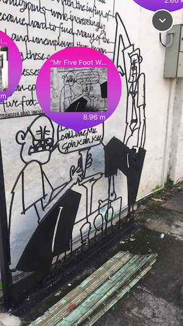

##  ARTSPerience

iOS apps developed for [Smarter Hackathon Penang](https://hackathon.aspen.com.my/) with ARKit. An AR app that a bit similar to PokemonGo but here is to find the Mural and Street Art in Penang, Malaysia. Able to show distance in realtime.

### Requirement

- Xcode 9
- Swift 4
- Cocoapods 1.3.1
- IPhone 6S and above (supported only)

### Main Library used
- HDAugmentedReality
- [ObjectMapper](https://github.com/Hearst-DD/ObjectMapper)

### Installation
- Run `pod install` in terminal and open the `.xcworkspace` file. Make sure [Cocoapods](https://cocoapods.org) already installed.
- All coordinate locations and images are hardcoded in `data.json` (Change it to any intended locations).

### Screenshots

